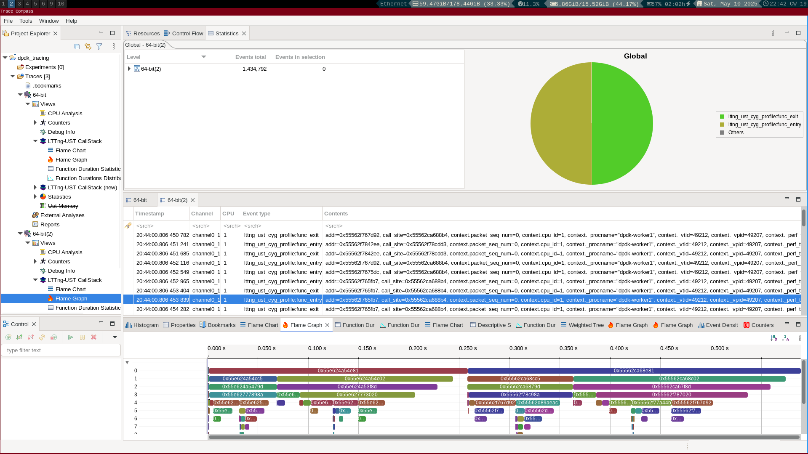

# DPDK Tracing with LTTng

This project focuses on enabling **LTTng** (Linux Trace Toolkit Next Generation) function tracing on **DPDK** (Data Plane Development Kit) by building it against the `liblttng-ust-cyg-profile.so` shared library.This library enables lttng to trace every function call by raising an event at the start and end of every fucntion in the compiled binary. We will collect function-level traces during the execution of different **testpmd scenarios**, including initial setup and traffic forwarding. After collecting the traces, we will analyze them using **TraceCompass**, focusing on metrics like **latency**, **function frequency**, and **cache/cycles/instructions** from function entry to exit.

The steps include:

1. Setting up LTTng and dpdk.
2. Running **testpmd** commands with function tracing enabled.
3. Analyzing trace data using **TraceCompass**.


## 📦 Prerequisites
* **DPDK**: The Data Plane Development Kit for high-performance networking. you can clone this from https://github.com/DPDK/dpdk.
* **LTTng**: The Linux Trace Toolkit to collect traces of userspace applications. it is available in most major distributions.
* **TraceCompass**: A tool to analyze trace files collected by LTTng.you can get a  binary for your operating system at https://projects.eclipse.org/projects/tools.tracecompass/downloads

Make sure you have the following installed:

* DPDK (more information on the installation method below.)
* LTTng
* TraceCompass
* A Linux environment (Ubuntu or similar is recommended, but the traces have been captured on a device running gentoo with 6.12.16 kernel)


## 🔧 Build DPDK with Function Instrumentation

To enable LTTng function tracing, you need to build DPDK against the `liblttng-ust-cyg-profile.so` shared library.

```bash
git clone https://github.com/DPDK/dpdk.git
cd dpdk
meson setup --buildtype=debug -Dexamples=all debugbuildtrace
cd debugbuildtrace
meson configure -Dc_args="-finstrument-functions" -Dcpp_args="-finstrument-functions"
ninja -C debugbuildtrace
```

## 🧠 Mount HugePages

DPDK requires hugepages for memory allocation. Run:

```bash
sudo mkdir -p /mnt/huge
sudo mount -t hugetlbfs nodev /mnt/huge
```

You can also enable hugepages at boot or dynamically allocate them:

```bash
echo 2048 | sudo tee /proc/sys/vm/nr_hugepages
```
## 🔍 Enable LTTng Tracing

 **Create a Trace script**:

   ```bash
   #!/bin/bash
    
    set -e
    
    trap error_handler ERR
    
    rm -rf output && mkdir output
    
    lttng create session1 --output=./output
    
    lttng enable-channel --userspace --num-subbuf=4 --subbuf-size=64M channel0
    
    lttng enable-event --channel channel0 --userspace --all
    lttng add-context --channel channel0 --userspace --type="procname"
    lttng add-context --channel channel0 --userspace --type="vtid"
    lttng add-context --channel channel0 --userspace --type="vpid"
    lttng add-context --channel channel0 --userspace --type="perf:thread:cpu-cycles"
    lttng add-context --channel channel0 --userspace --type="perf:thread:instructions"
    lttng add-context --channel channel0 --userspace --type="perf:thread:cache-misses"
    
    lttng start
    
    sleep 0.25 
    
    lttng destroy

   ```
  the time delay should be low because the throughput of events is pretty high and it can overload the system pretty quickly if left uncheked.

---

## 🚀 Run DPDK Application

Now, run **DPDK testpmd** with LTTng function tracing enabled.

### Example Commands:

Run DPDK in **server mode** on cores `0-1`:

```bash
export LD_PRELOAD=/usr/lib64/liblttng-ust-cyg-profile.so

/home/amdor/code/kernel_function_tracing/project/dpdk/build/app/dpdk-testpmd -l 0-1 --proc-type=primary --file-prefix=pmd1 --vdev=net_memif,role=server -- -i
```

Run DPDK in **client mode** on cores `2-3`:

```bash
export LD_PRELOAD=/usr/lib64/liblttng-ust-cyg-profile.so

/home/amdor/code/kernel_function_tracing/project/dpdk/build/app/dpdk-testpmd  -l 2-3 --proc-type=primary --file-prefix=pmd2 --vdev=net_memif -- -i
```

now do the steps blow in the defined order

 1. run start on client
 2. run start tx_first on server
 3. check that the packets are flowing through the network using command "show port stats 0"
 4. run the trace script
 5. quit the server and client.
---

## 📊 Analyze the Results



---

## Conclusion


---

## References


---
